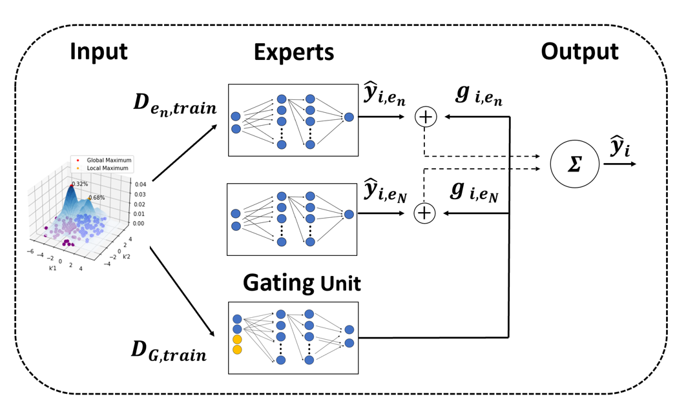

# uMoE - Training Neural Networks with uncertain data

Welcome to the Uncertainty-aware Mixture of Experts (uMoE) GitHub repository. This repository contains the implementation and documentation for our uMoE model, designed to train Neural Networks effectively using a mixture of experts architecture.

## Overview

The uMoE model is a powerful framework for dealing with uncertain data instances in various applications, including but not limited to financial modeling, medical diagnosis, and natural language processing tasks. It leverages a mixture of experts approach, neural networks, and probability density functions to make informed predictions while considering the inherent uncertainty in the data.

  

    
    
uMoE - Overview

  

## Documentation

For detailed information on the uMoE model and its usage, please refer to the documentation in the `docs` directory. It includes tutorials, user guides, and explanations of key concepts.
In this code:

We use a parent 
 with display: flex; justify-content: center; align-items: center; to center-align the child elements horizontally and vertically.
Inside the parent 
, we have two child 
 elements for each image and its caption.
Each child 
 is centered individually using text-align:center; and spaced apart with margin-right to create a gap between them.
You can adjust the width of the images and other CSS styles to fit your layout.
This code will center-align the images side by side with their respective captions. You can add more child 
 elements for additional images and captions as needed.

## Repository Contents

- **code**: This directory contains the Python code implementation of the uMoE model. It includes scripts for training, evaluation, and inference.

- **data**: Example Datasets, that were used for training.

- **docs**: Documentation related to the uMoE model, including user guides and tutorials.

- **models**: Saved model checkpoints and configurations.

## Getting Started

To get started with uMoE, please follow the steps below:

1. **Clone the Repository**: Clone this GitHub repository to your local machine using `git clone`.

2. **Install Dependencies**: Ensure you have all the necessary dependencies installed. You can find a list of required libraries in the `requirements.txt` file.

3. **Explore the Code**: Dive into the `code` directory to explore the codebase. Start with the `main.py` script to train the uMoE model.

4. **Use the Model**: After training, you can use the trained model for inference in your specific applications. Refer to the documentation in the `docs` directory for guidance on how to use uMoE effectively.

## Documentation

For detailed information on the uMoE model and its usage, please refer to the documentation in the `docs` directory. It includes tutorials, user guides, and explanations of key concepts.

## Citation

If you use this uMoE implementation in your research or projects, please consider citing our paper [insert citation here] for reference.

## Contributing

We welcome contributions from the community. If you find issues, want to add features, or have any suggestions, please open an issue or submit a pull request.

## License

This project is licensed under the [insert license name here] License - see the [LICENSE.md](LICENSE.md) file for details.

