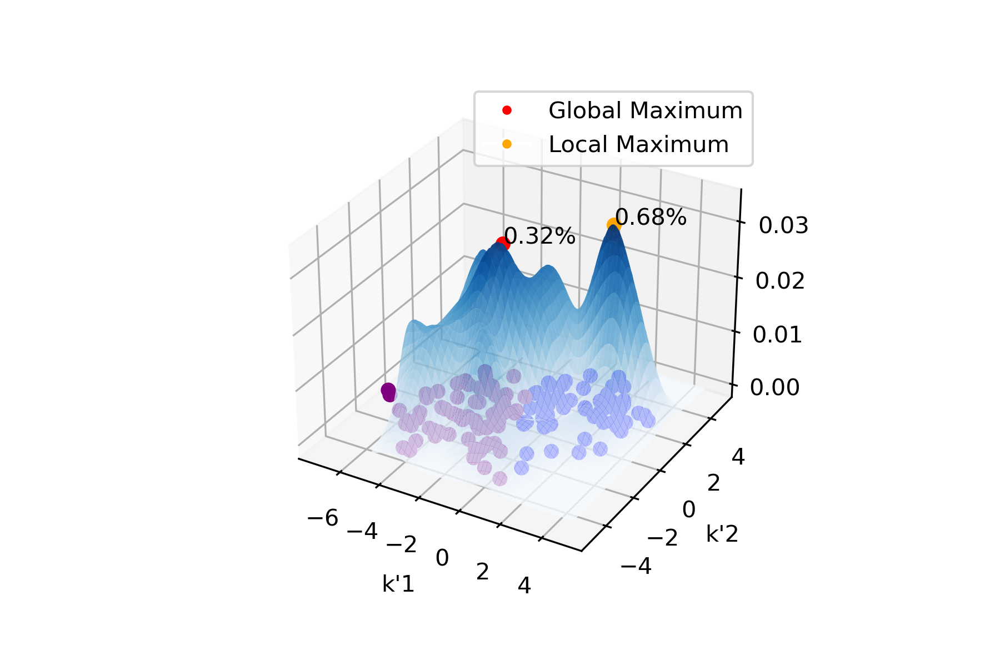

# uMoE - Training Neural Networks with uncertain data

Welcome to the Uncertainty-aware Mixture of Experts (uMoE) GitHub repository. This repository contains the implementation and documentation for our uMoE model, designed to train Neural Networks effectively using a mixture of experts architecture.
You can get access to the paper here.

## Overview

The uMoE model is a powerful framework for dealing with uncertain data instances in various applications, including but not limited to financial modeling, medical diagnosis, and natural language processing tasks. It leverages a mixture of experts approach, neural networks, and probability density functions to make informed predictions while considering the inherent uncertainty in the data.

  

    
    
uMoE - Overview

  

## Documentation
### Preprocessing Uncertain Instances
Working with datasets containing uncertain or missing instances is a common real-world challenge. This project incorporates the uframe library (Christian Amesoeder and Michael Hagn 2023) to handle uncertain data. The uframe extension enables the generation of multidimensional PDFs for uncertain instances using Multiple Imputations by Chained Equations (MICE) (Buuren and Groothuis-Oudshoorn 2011). It also transforms instances into objects, granting access to functions like global mode calculation and sampling. To get started, the uMoE model expects training data in the form of uframe objects. Uncertain attributes can be marked manually, and uframe generates a PDF using MICE, storing it as an object. In academic settings, attributes can be marked as uncertain for uMoE's training.

### Train uMoE Object with fit()
After preprocessing and converting data into uframe objects, you can train a uMoE object on uncertain instances using the fit() function. This highly customizable function allows you to specify various hyperparameters, including the learning rate, the number of training epochs, batch sizes for both Experts and the Gating Unit, as well as their corresponding NN-Architectures (number of hidden layers and neurons per layer). Elastic Net regularization (Zou and Hastie 2005) is employed to prevent overfitting by combining L1 (Lasso) and L2 (Ridge) regularization techniques. It encourages sparse model weights and handles highly correlated features effectively. You can set a threshold parameter, 'p', to control how much of the instance's uncertainty the model considers. By choosing 'p=1', the entire PDF is used for training, while values near 0 focus on a small area around the global mode value. The determination of local and global mode values employs the basin hopping optimizer, suitable for highly-dimensional landscapes (Wales and Doye 1997).

  

    
    
Demonstration of the Probability Density Function Decomposition

  

### Prediction with predict()
After training, the predict() function is used to make predictions on certain instances. It employs clustering to assign instances to relevant Experts and utilizes these Experts for predictions. Cluster probabilities for each instance are used as additional input for the Gating Unit. The final uMoE predictions are returned in a list.

### Evaluation with evaluation()
The evaluation() function calculates the performance of uMoE model predictions against true target values. It generates task-specific scores, computing accuracy for classification tasks and mean squared error for regression tasks. This function is crucial for assessing how well the model's predictions align with the ground truth.

## Citation

If you use this uMoE implementation in your research or projects, please consider citing our paper [Luttner, L. (2023): Training of Neural Networks with Uncertain Data – A Mixture of Experts Approach] for reference.

